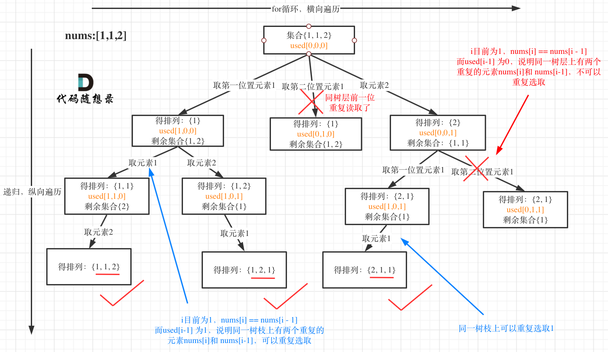
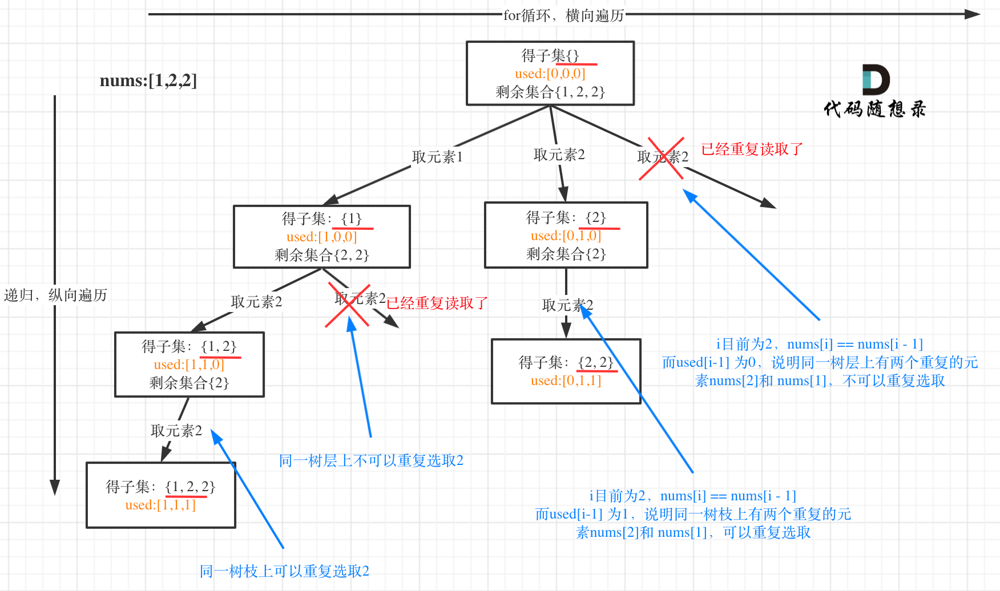

# 回溯

## 目录

* [框架](#框架)

* [棋盘](#棋盘)

    *   [51. N 皇后](#51-n-皇后)

    *   [37. 解数独](#37-解数独)

*   [排列](#排列)

    *   [46. 全排列](#46-全排列)
    
    *   [47. 全排列 II](#47-全排列-ii)
    
*   [子集](#子集)

    *   [78. 子集](#78-子集)

    *   [90. 子集 II](#90-子集-ii)

*   [组合](#组合)

    *   [77. 组合](#77-组合)

    *   [39. 组合总和](#39-组合总和)

    *   [40. 组合总和 II](#40-组合总和-ii)

    *   [216. 组合总和 III](#216-组合总和-iii)

    *   [17. 电话号码的字母组合](#17-电话号码的字母组合)

*   [切割](#切割)

    *   [131. 分割回文串](#131-分割回文串)

    *   [93. 复原 IP 地址](#93-复原-ip-地址)

    *   [698. 划分为k个相等的子集](#698-划分为k个相等的子集)

*   [其他](#其他)

    *   [22. 括号生成](#22-括号生成)

    *   [491. 递增子序列](#491-递增子序列)

    *   [332. 重新安排行程](#332-重新安排行程)

## 框架

```纯文本
result = []
def backtrack(路径, 选择列表):
    if 满足结束条件:
        result.add(路径)
        return

    for 选择 in 选择列表:
        做选择
        backtrack(路径, 选择列表)
        撤销选择
```

*   组合问题：N个数里面按一定规则找出k个数的集合

*   切割问题：一个字符串按一定规则有几种切割方式

*   子集问题：一个N个数的集合里有多少符合条件的子集

*   排列问题：N个数按一定规则全排列，有几种排列方式

*   棋盘问题：N皇后，解数独等等

# 棋盘

#### 51. N 皇后

```python
class Solution:
    def solveNQueens(self, n: int) -> List[List[str]]:
        res = []

        def get_queen(track):
            if len(track) == n:
                res.append(self.draw_chess(track[:]))
            
            for i in range(n):
                if not self.is_valid(track, i):
                    continue
                track.append(i)
                get_queen(track)
                track.pop(-1)
                
        get_queen([])

        return res


    def is_valid(self, track, idx) -> bool:
        if idx in track:
            return False

        len_ = len(track)
        for i, x in enumerate(track):
            if idx in [x-len_+i, x+len_-i]:
                return False

        return True


    def draw_chess(self, track):
        result = []
        len_ = len(track)
        for t in track:
            result.append("."*t + "Q" + "."*(len_-t-1))
        return result
```

#### 37. 解数独

```python
class Solution:
    def solveSudoku(self, board: List[List[str]]) -> None:
        """
        Do not return anything, modify board in-place instead.
        """
        def dfs(board, sr, sc):
            if sr == 9: return True
            if sc == 9:
                return dfs(board, sr+1, 0)
            if board[sr][sc] != '.':
                return dfs(board, sr, sc+1)
            
            for i in range(1, 10):
                if not is_valid(str(i), sr, sc, board):
                    continue
                board[sr][sc] = str(i)
                if dfs(board, sr, sc+1):
                    return True
                
                board[sr][sc] = '.'

            return False

        def is_valid(n, row, col, track):
            for i in range(9):
                if track[row][i] == n: return False
                if track[i][col] == n: return False
                if track[int(row/3)*3+int(i/3)][int(col/3)*3+i%3] == n: return False
            return True

        dfs(board, 0, 0)
```

# 排列

#### 46. 全排列

题目描述：给定一个不含重复数字的数组 `nums` ，返回其 **所有可能的全排列** 。你可以 **按任意顺序** 返回答案。

```python
class Solution:
    def permute(self, nums: List[int]) -> List[List[int]]:
        res = []

        def dfs(nums, track):
            if len(track) == len(nums):
                res.append(track[:])

            for i in range(len(nums)):
                if nums[i] in track:
                    continue
                track.append(nums[i])
                dfs(nums, track)
                track.pop(-1)

        dfs(nums, [])

        return res

```

#### 47. 全排列 II

题目描述：给定一个可包含重复数字的序列 `nums` ，**按任意顺序** 返回所有不重复的全排列。

题解：把序列排序，从左往右填，填过的做记录。



```python
class Solution:
    def permuteUnique(self, nums: List[int]) -> List[List[int]]:
        res = []
        nums.sort()
        used = [False]*len(nums)

        def dfs(track):
            if len(track) == len(nums):
                res.append(track[:])
            
            for i in range(len(nums)):
                if used[i]==True: continue
                if i>0 and nums[i]==nums[i-1] and used[i-1]==False:
                    continue
                used[i]=True
                track.append(nums[i])
                dfs(track)
                track.pop(-1)
                used[i]=False

        dfs([])
        return res

```

# 子集

> 📌**子集是收集树形结构中树的所有节点的结果**。
> **而组合问题、分割问题是收集树形结构中叶子节点的结果**。

#### 78. 子集

题目描述：给你一个整数数组 `nums` ，数组中的元素 **互不相同** 。返回该数组所有可能的子集（幂集）。

解集 **不能** 包含重复的子集。你可以按 **任意顺序** 返回解集。

题解：

*   递归

    ```python
    class Solution:
        def subsets(self, nums: List[int]) -> List[List[int]]:
            """
            subset[1,2,3] = subset[1,2] + [[x,3] for x in subset[1,2]]
            """
            if not nums: return [[]]

            last = nums.pop(-1)
            res = self.subsets(nums)

            for i in range(len(res)):
                res.append(res[i]+[last])

            return res

    ```

*   回溯

    ```python
    class Solution:
        def subsets(self, nums: List[int]) -> List[List[int]]: 
            res = []  # 需要所有分支的结果

            def dfs(nums, start, track):
                res.append(track[:])
                for i in range(start, len(nums)):
                    track.append(nums[i])
                    dfs(nums, i+1, track)
                    track.pop(-1)
                return
            
            dfs(nums, 0, [])

            return res

    ```

时间复杂度：O(n \* 2^n)。

空间复杂度：O(n)。即构造子集使用的临时数组 t 的空间代价。

#### 90. 子集 II

题目描述：给你一个整数数组  `nums` ，其中可能包含重复元素，请你返回该数组所有可能的子集（幂集）。解集 不能 包含重复的子集。返回的解集中，子集可以按 任意顺序 排列。



```python
class Solution:
    def subsetsWithDup(self, nums: List[int]) -> List[List[int]]:
        res = []
        nums.sort()  # 关键

        def dfs(nums, start, track):
            res.append(track[:])
            for i in range(start, len(nums)):
                if i>start and nums[i]==nums[i-1]:  # 关键
                    continue
                track.append(nums[i])
                dfs(nums, i+1, track)
                track.pop(-1)
            return
        
        dfs(nums, 0, [])
        return res
```

# 组合

#### 77. 组合

题目描述：给定两个整数 `n` 和 `k`，返回范围 `[1, n]` 中所有可能的 `k` 个数的组合。

题解：按照之前的题，把路径画出来，就知道该如何剪枝了。

```python
class Solution:
    def combine(self, n: int, k: int) -> List[List[int]]:
        res = []

        def dfs(n, start, track):
            if len(track) == k:
                res.append(track[:])

            for i in range(start, n+1):
                track.append(i)
                dfs(n, i+1, track)
                track.pop(-1)
                

        dfs(n, 1, [])
        return res
```

#### 39. 组合总和

题目描述：给你一个 无重复元素 的整数数组 candidates 和一个目标整数 target ，找出 candidates 中可以使数字和为目标数 target 的 所有不同组合 ，并以列表形式返回。你可以按 任意顺序 返回这些组合。

candidates 中的 同一个 数字可以 无限制重复被选取 。如果至少一个数字的被选数量不同，则两种组合是不同的。 对于给定的输入，保证和为 target 的不同组合数少于 150 个。

```python
class Solution:
    def combinationSum(self, candidates: List[int], target: int) -> List[List[int]]:
        res = []
        candidates.sort()

        def dfs(track, start, target):
            if target==0:
                res.append(track[:])
            for i in range(start, len(candidates)):
                if candidates[i] > target: break
                track.append(candidates[i])
                dfs(track, i, target-candidates[i]) # 从i开始，代表可以重复取当前数值
                track.pop(-1)

        dfs([], 0, target)
        
        return res
```

#### 40. 组合总和 II

题目描述：

给你一个由候选元素组成的集合 candidates (存在重复元素) 和一个目标数 target ，找出 candidates 中所有可以使数字和为 target 的组合。

candidates 中的每个元素在每个组合中只能使用 一次 。

```python
class Solution:
    def combinationSum2(self, candidates: List[int], target: int) -> List[List[int]]:
        res = []
        candidates.sort()
        used = [False] * len(candidates)

        def dfs(track, start, target):
            if target==0:
                res.append(track[:])
            for i in range(start, len(candidates)):
                if candidates[i] > target: break
                if i>0 and candidates[i]==candidates[i-1] and used[i-1]==False:
                    continue
                track.append(candidates[i])        
                used[i] = True
                dfs(track, i+1, target-candidates[i])
                used[i] = False
                track.pop(-1)
        
        dfs([], 0, target)
        return res
```

可以用startindex 控制 让结果不重复

```python
class Solution:
    def combinationSum2(self, candidates: List[int], target: int) -> List[List[int]]:
        res = []
        candidates.sort()

        def dfs(track, start, target):
            if target==0:
                res.append(track[:])
            for i in range(start, len(candidates)):
                if candidates[i] > target: break
                if i>start and candidates[i]==candidates[i-1]:
                    continue
                track.append(candidates[i])        
                dfs(track, i+1, target-candidates[i])
                track.pop(-1)
        
        dfs([], 0, target)
        return res
```

#### 216. 组合总和 III

```python
class Solution:
    def combinationSum3(self, k: int, n: int) -> List[List[int]]:
        res = []
        def dfs(track, start, target):
            if target==0 and len(track)==k:
                res.append(track[:])
            if len(track)>k or target<0:
                return
            
            for i in range(start, 10):
                # if i in track: continue
                track.append(i)
                dfs(track, i+1, target-i)
                track.pop(-1)
        dfs([], 1, n)
        return res
```

#### 17. 电话号码的字母组合

多个集合求组合

```python
class Solution:
    def letterCombinations(self, digits: str) -> List[str]:
        if not digits: return []
        res = []
        letter_map = {
            '2': 'abc',
            '3': 'def',
            '4': 'ghi',
            '5': 'jkl',
            '6': 'mno',
            '7': 'pqrs',
            '8': 'tuv',
            '9': 'wxyz'
        }
        digits = [letter_map.get(c, "") for c in digits]

        def dfs(digits, start, track):
            if start==len(digits):
                res.append(track)
                return
            
            letters = digits[start]
            for j in letters:
                # 下列三行代码，等价于dfs(digits, start+1, track+j)
                track += j
                dfs(digits, start+1, track)
                track = track[:-1]
        
        dfs(digits, 0, "")
        return res
```

# 切割

#### 131. 分割回文串

```python
class Solution:
    def partition(self, s: str) -> List[List[str]]:
        res = []

        def dfs(track, start):
            if start>=len(s):
                res.append(track[:])
            for i in range(start, len(s)):
                if self._isPalindrome(s[start:i+1]):
                    track.append(s[start:i+1])
                    dfs(track, i+1)
                    track.pop(-1)

        dfs([], 0)

        return res

    def _isPalindrome(self, s: str) -> bool:
        i, j = 0, len(s)-1
        while i<j:
            if s[i]!=s[j]:
                return False
            i, j = i+1, j-1
        return True
```

#### 93. 复原 IP 地址

```python
class Solution:
    def restoreIpAddresses(self, s: str) -> List[str]:
        """
        思路：砍三刀
        """
        res = []

        def dfs(k, s, start, track):
            if k == 0:
                if is_valid(s[start:]):
                    res.append(".".join(track) + "."+ s[start:])
                return
            
            for i in range(start+1, min(start+4, len(s))):
                if not is_valid(s[start:i]):
                    continue
                track.append(s[start:i])
                dfs(k-1, s, i, track)
                track.pop(-1)

        def is_valid(ip):
            if ip[0] == '0' and ip!='0':
                return False
            if int(ip) > 255:
                return False
            return True

        dfs(3, s, 0, [])
        return res
```

#### 698. 划分为k个相等的子集

```python
class Solution:
    def canPartitionKSubsets(self, nums: List[int], k: int) -> bool:
        """
        思路：一个个桶装
        """
        if k > len(nums): return False

        sum_ = sum(nums)
        if sum_%k != 0: return False

        target = sum_ / k

        visited = [0] * len(nums)
        
        def backtrace(k, nums, index, target, visited, bucket):
            """
            bucket:当前桶中的数据和
            visited:记录哪些数据已经用过了
            """
            if k == 0: return True # 每个桶都装好了
            
            if bucket == target:
                # 装下一个桶
                if backtrace(k-1, nums, 0, target, visited, 0):
                    return True

            for i in range(index, len(nums)):
                if visited[i] == 1 or bucket + nums[i] > target:
                    continue
                visited[i] = 1
                bucket += nums[i]
                if backtrace(k, nums, i+1, target, visited, bucket):
                    return True
                bucket -= nums[i]
                visited[i] = 0

            return False

        return backtrace(k, nums, 0, target, visited, 0)
```

# 其他

#### 22. 括号生成

```python
class Solution:
    def generateParenthesis(self, n: int) -> List[str]:
        res = []

        def dfs(left, right, track):
            """
            可用的左括号数量为 left 个，可用的右括号数量为 rgiht 个
            """
            if left==0 and right==0:
                res.append(track)
                return

            if right < left: return
            if right < 0 or left < 0: return

            track += '('
            dfs(left-1, right, track)
            track = track[:-1]

            track += ')'
            dfs(left, right-1, track)
            track = track[:-1]
        
        dfs(n, n, "")
        return res
```

#### 491. 递增子序列

题目描述：给你一个整数数组 `nums` ，找出并返回所有该数组中不同的递增子序列，递增子序列中 **至少有两个元素** 。你可以按 **任意顺序** 返回答案。
数组中可能含有重复元素，如出现两个整数相等，也可以视作递增序列的一种特殊情况。

输入：`nums = [4,6,7,7]`
输出：`[[4,6],[4,6,7],[4,6,7,7],[4,7],[4,7,7],[6,7],[6,7,7],[7,7]]`

```python
class Solution:
    def findSubsequences(self, nums: List[int]) -> List[List[int]]:
        """
        这个nums是无序的，且求子序列，不能排序，所以不能采用之前的去重方案
        需要一个set记录访问过的数值
        注意：深度遍历中每一层都会有一个全新的visited用于记录本层元素是否重复使用
        """
        res = []
        len_ = len(nums)

        def dfs(track, start):
            if len(track)>=2:
                res.append(track[:])

            visited = set()
            for i in range(start, len_):
                if (track and nums[i] < track[-1]) or nums[i] in visited:
                    continue
                track.append(nums[i])
                visited.add(nums[i])
                dfs(track, i+1)
                track.pop(-1)
        
        dfs([], 0)
        return res
```

这道题和 [47. 全排列 II](https://leetcode-cn.com/problems/permutations-ii/ "47. 全排列 II") 比较像，只需要做树层去重，允许树枝选择相同数值。

引出[https://programmercarl.com/回溯算法去重问题的另一种写法.html](https://programmercarl.com/回溯算法去重问题的另一种写法.html# "https://programmercarl.com/回溯算法去重问题的另一种写法.html")

#### 332. 重新安排行程

难点：1. 采用什么样的数据结构存储所有的tickets
&#x20;         2\. 如何删除比较合适或者标记已经用过的ticket（不删的话会有死循环）

```python
from collections import defaultdict

class Solution:
    def findItinerary(self, tickets: List[List[str]]) -> List[str]:
        # defaultdic(list) 是为了方便直接append
        tickets_dict = defaultdict(list)
        for item in tickets:
            tickets_dict[item[0]].append(item[1])
        '''
        tickets_dict里面的内容是这样的
         {'JFK': ['SFO', 'ATL'], 'SFO': ['ATL'], 'ATL': ['JFK', 'SFO']})
        '''
        path = ["JFK"]
        def backtracking(start_point):
            # 终止条件
            if len(path) == len(tickets) + 1:
                return True
            tickets_dict[start_point].sort()
            for _ in tickets_dict[start_point]:
                #必须及时删除，避免出现死循环
                end_point = tickets_dict[start_point].pop(0)
                path.append(end_point)
                # 只要找到一个就可以返回了
                if backtracking(end_point):
                    return True
                path.pop()
                tickets_dict[start_point].append(end_point)

        backtracking("JFK")
        return path
```
